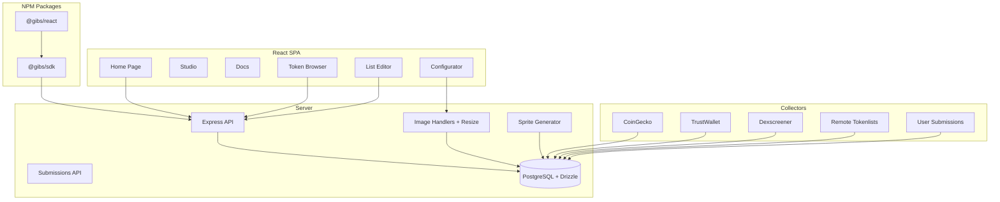
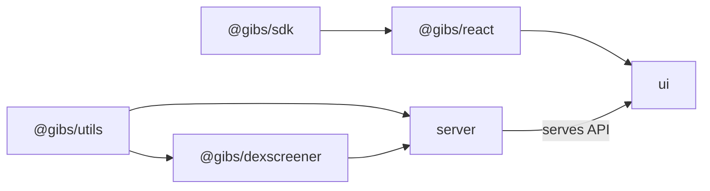

# Gib.Show Codebase Map

> Auto-generated by Cartographer. Last mapped: 2026-03-31

## System Overview

Gib.Show is a decentralized token metadata and image API. It collects token data from 30+ providers (CoinGecko, TrustWallet, Uniswap, Dexscreener, etc.), stores images with priority ordering, and serves them via a REST API with on-the-fly resize, sprite sheets, and CDN caching.



## Tech Stack

| Layer | Technology |
|-------|-----------|
| Server | Node 24, Express 5, Drizzle ORM (PostgreSQL), sharp, viem |
| UI | React 19, React Router 7 (HashRouter), Tailwind CSS 4, Headless UI 2, Vite 6 |
| SDK | TypeScript, zero runtime dependencies |
| React Components | @gibs/react wraps @gibs/sdk |
| Testing | Vitest (685 tests), Testing Library, Playwright |
| CI/CD | GitHub Actions (5 jobs), Docker multi-stage, Railway |

## Package Dependency Graph



- `@gibs/utils` — internal, server-only, workspace dependency
- `@gibs/sdk` + `@gibs/react` — published to npm with OIDC provenance
- `ui` — private SPA, built by Vite, served as static files
- `server` — Express API + collection pipeline + Drizzle ORM

## Directory Structure

```
packages/
  server/src/
    bin/              Entry points (server, collect, migrate, create-orders)
    collect/          30+ collectors (one per provider) + base class
    db/               Drizzle schema, queries, sync-order, migrations
    server/           Express routes: image/, list/, sprite/, submissions
    sanitize.ts       Image sanitization (sharp re-encode + SVG stripping)
    types.ts          Shared server types
  server/drizzle/     Drizzle migration SQL + snapshots
  ui/src/lib/
    pages/            Home, Studio, Docs
    components/       30+ React components
    contexts/         Theme, Settings, Metrics, Studio, ListEditor
    hooks/            useMetrics, useLocalLists, useVCSPublish, useRpcMetadata
    utils/            Pure functions: formatting, token-search, dedup, badge-position
    physics/          2D physics engine (optional canvas animation)
  sdk/src/            @gibs/sdk — vanilla JS/TS client
  react/src/          @gibs/react — React components
  utils/src/          @gibs/utils — fetch, viem, logging
  dexscreener/src/    @gibs/dexscreener — API client + collector
```

## Database (Drizzle ORM)

**Schema:** `packages/server/src/db/schema.ts` — 18 tables  
**Client:** `packages/server/src/db/drizzle.ts` — singleton with `casing: 'snake_case'`  
**Migrations:** `packages/server/drizzle/` — single idempotent baseline (IF NOT EXISTS + DO/EXCEPTION)

### Table Relationships

```
provider → list (1:many)
provider → tag (1:many)
list → list_token (1:many)
list_token → token (many:1)
token → network (many:1)
list_token → image (many:1, nullable)
image → link (1:many, URI cache)
image → image_variant (1:many, resize cache)
list_order → list_order_item (1:many)
bridge → bridge_link (1:many)
bridge_link → token×2 (native + bridged)
list_token → header_link (1:1, optional banner)
list_submission (standalone)
```

### Key Query: `applyOrder()`

The centerpiece DB function — builds a CTE with `dense_rank()` window function:

```sql
dense_rank() OVER (
  PARTITION BY token_id, network_id
  ORDER BY
    ranking/1000 ASC,          -- provider group (from collectables.ts order)
    format_preference ASC,     -- SVG > webp > raster
    major DESC, minor DESC,    -- list version
    default ASC, key ASC,      -- tiebreakers
    list_token_order_id ASC
)
```

- `dedupe=true`: WHERE rank=1 (image endpoints — one best image per token)
- `dedupe=false`: all rows (token list endpoints — show all sources)
- `sorted=true`: adds outer ORDER BY (tokensByChain)

## Collection Pipeline

30+ collectors registered in `collectables.ts` — **order defines image priority** (lower index = higher priority):

```
0: gibs        5: internetmoney   10: trustwallet
1: pulsex      6: midgard         11: smoldapp
2: dexscreener 7: pumptires       12: coingecko
3: countries   8: etherscan       13: uniswap
4: pulsechain  9: routescan       14+: others...
```

Two-phase contract (`BaseCollector`):
1. **Discover** — create provider/list/network rows only (no images)
2. **Collect** — fetch tokens + images, sanitize, store

`sync-order.ts` assigns `ranking = position × 1000 + subIndex` per provider after Phase 1.

## API Routes

### Images

| Endpoint | Handler | Description |
|----------|---------|-------------|
| `GET /image/{chainId}/{address}` | `getImage(false)` | Token image (no explicit order) |
| `GET /image/{order}/{chainId}/{address}` | `getImage(true)` | Order-aware lookup |
| `GET /image/fallback/{order}/{chainId}/{address}` | `getImageAndFallback` | Ordered with unordered fallback |
| `GET /image/direct/{imageHash}` | `getImageByHash` | Hash-addressed direct |
| `GET /image/{chainId}` | `bestGuessNetworkImage` | Network icon |
| `GET /image/?i=...` | `tryMultiple` | Multi-source batch |

**Query params:** `?as=webp` (format conversion), `?only=vector` (source filter), `?w=N&h=N` (resize), `?mode=link` (force redirect)

### Lists

| Endpoint | Description |
|----------|-------------|
| `GET /list/merged/{order}` | All tokens, priority-ordered |
| `GET /list/tokens/{chainId}` | Tokens by chain with source annotations |
| `GET /list/{provider}/{key}` | Single provider list |
| `GET /list/` | List metadata index |

### Other

| Endpoint | Description |
|----------|-------------|
| `GET /stats` | Token counts by chain |
| `GET /networks` | All networks |
| `GET /sprite/{provider}/{key}` | Sprite manifest (JSON) |
| `GET /sprite/{provider}/{key}/sheet` | Sprite sheet (WebP) |
| `POST /api/lists/submit` | Submit a token list URL |
| `POST /api/images/submit` | Upload token image (base64) |

## UI Architecture

### Context Hierarchy

```
ThemeProvider → SettingsProvider → MetricsProvider → StudioProvider → ListEditorProvider
```

### Pages

- **Home** — hero, metrics, network grid, API examples
- **Studio** — three-panel: ListEditor | Browser (380px) | Configurator
- **Docs** — filterable endpoint cards with live response previews

### Pure Function Extraction Pattern

Logic extracted from components into `utils/` modules:

| Module | Functions | Used By |
|--------|-----------|---------|
| `formatting.ts` | formatBytes, detectImageFormat, buildImageUrlWithSize, truncateAddress, generateRepoName, generateCommitMessage, formatPercent, overlapLabel, cubicEaseOut, clampValue | EndpointCard, TokenImageManager, BadgeConfigurator, useVCSPublish |
| `token-search.ts` | filterTokensBySearch, sortTokensMainnetFirst, getPopularChains, countResults, isCacheHit, parsePathParams, categorizeListsByScope | StudioBrowser, EndpointCard, TokenSearch |
| `dedup-tokens.ts` | deduplicateTokens, mergeTokenIntoMap | StudioBrowser |
| `code-output.ts` | shadowToCSS, shapeToCSS, buildImageUrl, buildNetworkUrl | CodeOutput |
| `list-order.ts` | isDefaultOrder, reorderArray, DEFAULT_PROVIDERS | ListResolutionOrder |
| `badge-position.ts` | badgePositionToCSS | BadgeConfigurator, CodeOutput, StudioConfigurator |
| `image-upload.ts` | validateImageFile, readFileAsDataUri, submitImage | ImageUpload, ListEditor |

## Testing

| Package | Tests | Lines | Branches |
|---------|-------|-------|----------|
| server | 281 | 99.8% | 97.8% |
| ui | 404 | — | — |
| **Total** | **685** | | |

### Server Coverage Detail

| File | Lines | Branches | Notes |
|------|-------|----------|-------|
| handlers.ts | 99.5% | 95.7% | 1 dead-code line uncovered |
| resize.ts | 100% | 100% | |
| submissions.ts | 100% | 97.7% | |
| list/utils.ts | 100% | 100% | |
| sanitize.ts | 100% | 100% | |

### UI Test Coverage

| Category | Files Tested |
|----------|-------------|
| Utils | badge-position, code-output, dedup-tokens, formatting, image-upload, list-order, network-name, token-search |
| Hooks | useLocalLists, useRpcMetadata, useVCSPublish |
| Components | BottomDrawer, EndpointCard, NumberStepper, TokenImageManager |

## CI Pipeline

5 parallel jobs on every push (`.github/workflows/test.yml`):

| Job | Command |
|-----|---------|
| lint | `cd packages/server && yarn lint` (prettier + eslint) |
| typecheck | `npx tsc --noEmit` |
| build | `yarn run build` (sequential: utils → dex → ui → server) |
| unit-test | `node --test` (legacy sync-order + db-batch) |
| integration-test | Docker Bake → compose up → health check → `yarn run test` |

`docker-compose.ci.yml` overrides postgres `shm_size: 16g → 256m` for CI runners.

NPM publishing: push `sdk-v*` tag → test → publish `@gibs/sdk` → publish `@gibs/react`.

## Navigation Guide

**Add a collector:** Create in `src/collect/`, extend `BaseCollector`, register in `collectables.ts` (position = priority)

**Add an API endpoint:** Handler in `src/server/`, route in module's `index.ts` or `routes.ts`

**Add a UI component:** Create in `ui/src/lib/components/`, extract pure logic to `utils/`

**Change image priority:** Reorder entries in `collectables.ts`

**Add a UI utility:** Add to appropriate `utils/*.ts` file, add tests in `utils/*.test.ts`

**Modify Studio layout:** `Studio.tsx` (panels), `StudioBrowser.tsx` (token list), `StudioConfigurator.tsx` (preview + controls)
