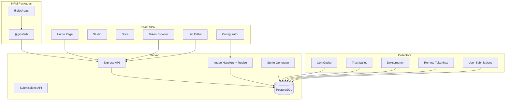
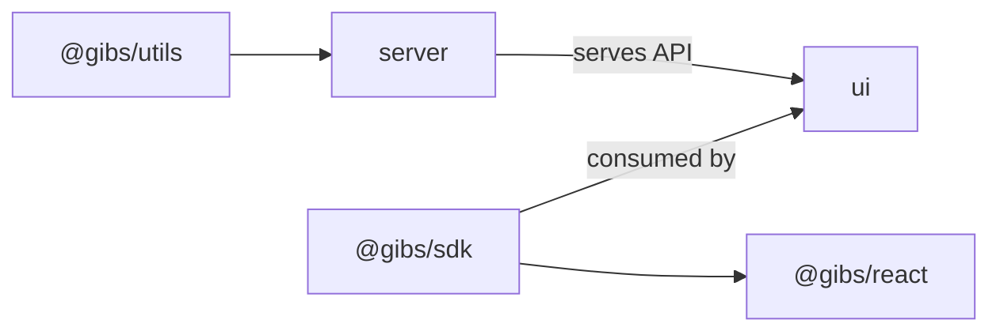
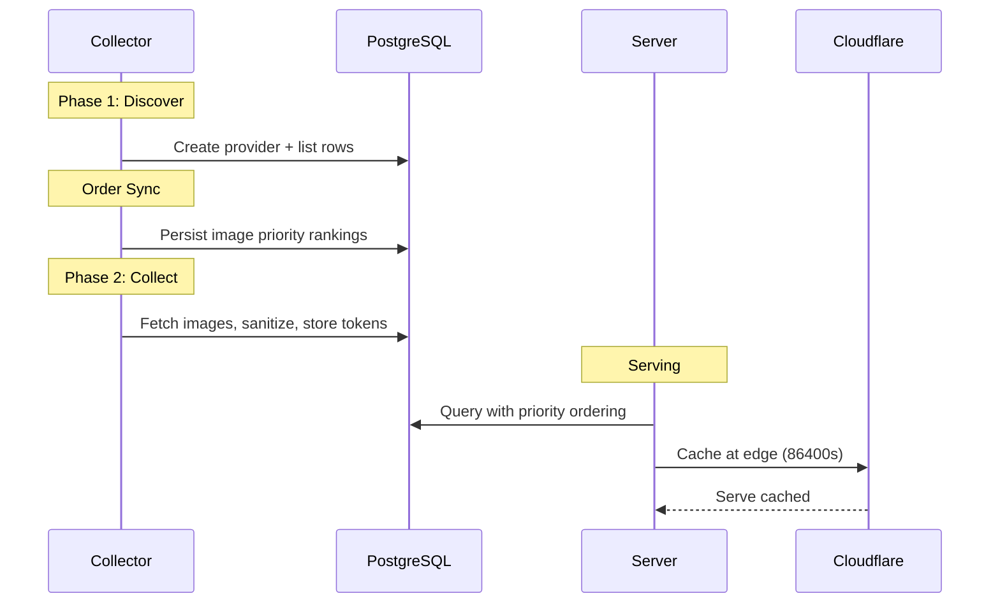

# Gib.Show Codebase Map

> Auto-generated by Cartographer. Last mapped: 2026-03-24

## System Overview

Gib.Show is a decentralized token metadata and image API. It collects token data from 30+ providers (CoinGecko, TrustWallet, Uniswap, Dexscreener, etc.), stores images with priority ordering, and serves them via a REST API with on-the-fly resize, sprite sheets, and CDN caching.



## Tech Stack

| Layer | Technology |
|-------|-----------|
| Server | Node 24, Express, Knex (PostgreSQL), sharp, viem |
| UI | React 19, React Router 7 (HashRouter), Tailwind CSS 4, Headless UI 2, Vite 6, Shiki |
| SDK | TypeScript, zero dependencies |
| React Components | @gibs/react, wraps @gibs/sdk |
| Testing | Vitest, Testing Library, Playwright |
| CI/CD | GitHub Actions, Docker, Railway |

## Directory Structure

```
packages/
  server/src/
    bin/              Entry points (server, collect, one-off scripts)
    collect/          33 collectors (one per provider) + base class
    db/               Knex setup, queries, migrations, sync-order
    server/           Express routes: image/, list/, sprite/, submissions, networks
    sanitize.ts       Image sanitization (sharp re-encode + SVG stripping)
    types.ts          Shared server types
  ui/src/
    lib/
      pages/          Home, Studio, Docs
      components/     30+ React components
      contexts/       Theme, Settings, Metrics, Studio, ListEditor
      hooks/          useMetrics, useLocalLists, useVCSPublish, useRpcMetadata
      utils/          dedup-tokens, badge-position, network-name
      physics/        2D physics engine (optional canvas animation)
    app.css           Tailwind design tokens + utility classes
  sdk/src/            @gibs/sdk — vanilla JS/TS client
  react/src/          @gibs/react — React components
  utils/src/          @gibs/utils — server-side utilities (viem, fetch, retry)
```

## Package Dependency Graph



- `@gibs/utils` — internal, server-only, consumed from TypeScript source
- `@gibs/sdk` + `@gibs/react` — published to npm, consumed by external apps
- `ui` — private, built by Vite, deployed as static SPA
- `server` — Express API + collection pipeline

## Data Flow

### Collection Pipeline



### Image Serving

```
GET /image/:chainId/:address
  → applyOrder (SVG > raster, provider ranking)
  → maybeResize (?w=N&h=N&format=webp)
  → sendImage (save mode: DB content, link mode: redirect)
  → Cloudflare edge cache (24h)
```

### Studio UI

```
User selects chain → GET /list/tokens/:chainId (batch endpoint)
  → Virtualized token list (sorted by popularity)
  → Click token → Configurator preview (infinite canvas)
  → Adjust appearance → Code output (SDK/React/HTML/img)
  → Publish list → GitHub/GitLab/Gitea
  → Submit to Gib.Show → /api/lists/submit
```

## Key Modules

### Server: Collectors (`packages/server/src/collect/`)

**Base class:** `BaseCollector` — abstract with `discover()` and `collect()` phases.

**33 collectors** registered in `collectables.ts`. Order defines image priority ranking (higher = preferred):
1. gibs (internal)
2. pulsex, dexscreener, countries, pulsechain
3. internetmoney, midgard, pumptires
4. etherscan, routescan, trustwallet
5. ...coingecko, uniswap (lower priority)
6. User submissions (lowest, appended dynamically)

**Key collectors:**
- `remote-tokenlist.ts` — Generic fetcher for any Uniswap-format JSON tokenlist
- `trustwallet.ts` — Reads from Git submodule, resolves chain IDs via chainlist.org with disambiguation
- `coingecko.ts` — Creates dual lists per platform (thumb + large variants)
- `user-submissions.ts` — Loads approved submissions from DB, creates RemoteTokenListCollector instances

### Server: Database (`packages/server/src/db/`)

**Tables:** network, provider, image, list, token, list_token, link, list_order, list_order_item, bridge, bridge_link, image_variant, list_submission

**Key queries:**
- `insertImage()` — sanitizes, detects format, stores with mode (save/link)
- `applyOrder()` — dense-rank ordering with SVG boost
- `getTokensUnderListId()` — joins list_token → token → network → image
- `getListOrderId()` — resolves order by key name or hex ID fragment

### Server: Image Handling (`packages/server/src/server/image/`)

- `handlers.ts` — GET routes for token/network images with fallback chains
- `resize.ts` — On-the-fly sharp resize with DB-persisted variant cache, rate limiting
- `sprite.ts` — Sprite sheet generation (WebP grid + JSON manifest, mixed mode for inline SVGs)

### Server: Submissions (`packages/server/src/server/submissions.ts`)

User list submission registry:
- `POST /api/lists/submit` — validates URL, probes content
- `GET /api/lists/submissions` — list/filter submissions
- `PATCH /api/lists/submissions/:id` — approve/reject
- Auto-mode: link by default, promotes to save at 100+ subscribers

### UI: Studio (`packages/ui/src/lib/pages/Studio.tsx`)

Three-panel sliding layout:
```
|  List Editor (calc(100vw - 380px))  |  Browser (380px)  |  Configurator (calc(100vw - 380px))  |
```

URL params drive navigational state: `?chain=`, `?token=`, `?editor=`
localStorage stores visual preferences (appearance, badge, code format)

### UI: State Management

Five separate React contexts (no Redux/Zustand):
- `ThemeContext` — light/dark/system
- `SettingsContext` — showTestnets
- `MetricsContext` — platform metrics + provider index (fetched once, cached 3h)
- `StudioContext` — appearance, badge, code format (preferences in localStorage)
- `ListEditorContext` — local list CRUD (IndexedDB via idb-keyval)

### SDK (`packages/sdk/src/`)

Zero-dependency client: `createClient()` → URL builders + fetch wrappers + sprite helpers.

### React Components (`packages/react/src/`)

`GibProvider` → `TokenImage` / `NetworkImage` / `GibImage` with skeleton + lazy loading.

## Conventions

- **Functional React only** — no class components
- **`useMemo` for derived state** — no useState+useEffect for computed values
- **`dark:` Tailwind utilities** on inline classes; `.dark .class` in app.css for custom utilities
- **`getApiUrl(path)`** for all API URLs — single source of truth
- **`rounded-lg` everywhere** — normalized border radius
- **Image component** — shared skeleton+lazy+IntersectionObserver, used across all images
- **No console.log in production** — only console.error/warn for actual errors

## Testing

| Package | Tests | Coverage |
|---------|-------|----------|
| ui | 88+ | 45% stmts (components untested, utils/hooks high) |
| server | 64+ | 84% stmts (sanitize 100%, submissions 73%) |
| sdk | 50+ | 80% stmts (sprite 100%, client 26%) |
| react | 28 | 91% stmts |
| utils | 20 | 59% stmts (viem 24%, fetch 67%) |

**Playwright E2E:** 12 visual regression tests (Home/Docs/Studio in light+dark+mobile)

## Known Issues / Technical Debt

1. **`lodash` undeclared** in `@gibs/utils` — relies on server's node_modules
2. **`getThumbnailUrl` not exported** from SDK index; `ListInfo` type also not exported
3. **SDK client fetch methods untested** — need HTTP mocking
4. **`utils/viem.ts` untested** — complex RPC logic with zero coverage
5. **ESLint 8 EOL** — server uses deprecated ESLint, needs config migration for v9
6. **45 Dependabot vulnerabilities** — mostly transitive, 1 critical
7. **`PaginationControls` dead code** — defined but no longer imported (replaced by virtual list)
8. **PhysicsCanvas unused** — defined but not mounted in any active route
9. **Knex camelCase transformer is global** — raw SQL aliases must match expected camelCase output
10. **`image` table is UPDATE-revoked** at DB level — only INSERT via upsert
11. **`collectables()` memoized but mutated** — user-submission collectors injected at runtime
12. **`pruneVariants()` resets ALL accessCount to 0** — broad reset after each prune cycle
13. **SVG sanitization is regex-based** — susceptible to catastrophic backtracking on malformed SVGs
14. **Bare `/image/:chainId/:address` route has no ordering** — non-deterministic first-row wins

## Navigation Guide

**To add a new collector:** Create a file in `packages/server/src/collect/`, extend `BaseCollector` or use `RemoteTokenListCollector`, add to `collectables.ts`

**To add a new UI component:** Create in `packages/ui/src/lib/components/`, import in the consuming page/component

**To add an API endpoint:** Add handler in `packages/server/src/server/`, register route in the module's `index.ts` or `routes.ts`

**To add an SDK method:** Add to `packages/sdk/src/client.ts` interface + implementation, export from `index.ts`

**To modify the Studio layout:** Edit `packages/ui/src/lib/pages/Studio.tsx` for layout, `StudioConfigurator.tsx` for toolbar/canvas, `StudioBrowser.tsx` for token list

**To change image priority:** Edit collector order in `packages/server/src/collect/collectables.ts`

**To add a CSS utility class:** Edit `packages/ui/src/app.css`, use `.dark .class` pattern for dark mode
